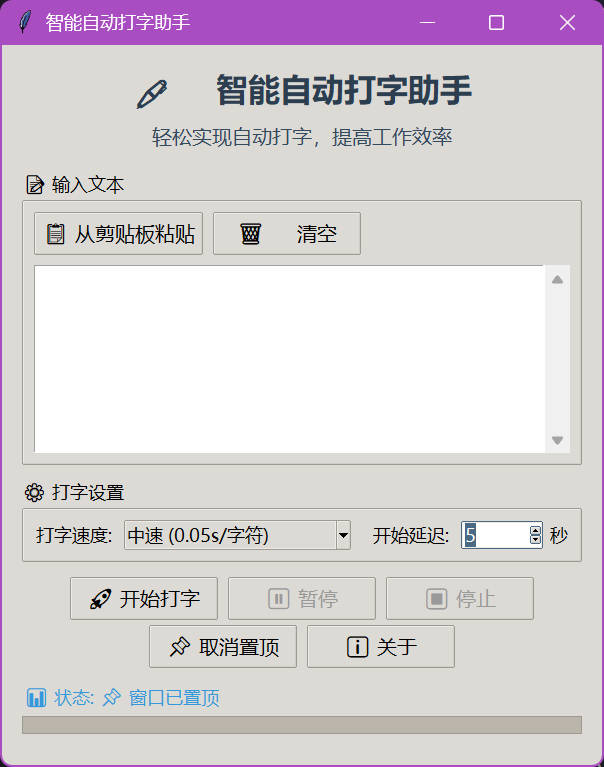
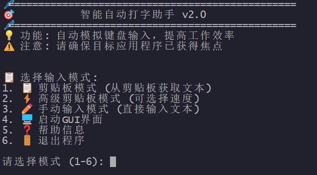

# 🖊️ 智能自动打字助手

一个功能强大、界面美观的自动打字工具，支持命令行和图形界面两种模式，帮助您提高工作效率。


## ✨ 功能特性

### 🎯 核心功能
- **多种输入模式**: 支持剪贴板、手动输入等多种文本来源
- **灵活速度控制**: 4种预设速度 + 自定义速度设置
- **实时进度显示**: 打字进度实时反馈，支持暂停/继续/停止
- **智能倒计时**: 可自定义倒计时时间，给您充足的准备时间
- **安全中断**: 随时按 Ctrl+C 安全中断操作

### 🖥️ 双界面支持
- **命令行界面**: 轻量级，适合高级用户和自动化场景
- **图形界面**: 现代化设计，直观易用，适合所有用户

### 🛡️ 安全特性
- **非侵入性**: 纯模拟键盘输入，不修改系统设置
- **可控性强**: 支持实时暂停、继续和停止
- **错误处理**: 完善的异常处理机制

## 📸 界面预览

### 图形界面版本

*现代化的图形界面，直观易用，支持实时控制和进度显示*

### 命令行版本

*简洁的命令行界面，轻量高效，适合高级用户*

## 📦 安装说明

### 环境要求
- Python 3.7 或更高版本
- Windows / macOS / Linux 操作系统

### 快速安装

1. **克隆或下载项目**
   ```bash
   git clone <repository-url>
   cd auto-typer
   ```

2. **安装依赖**
   ```bash
   pip install -r requirements.txt
   ```

3. **运行程序**
   ```bash
   # 命令行版本
   python auto_typer.py
   
   # 图形界面版本
   python auto_typer_gui.py
   ```

### 依赖包说明
- `pyautogui`: 自动化GUI操作库
- `pyperclip`: 剪贴板操作库
- `tkinter`: Python内置GUI库（通常已预装）

## 🚀 使用指南

### 命令行版本

#### 启动程序
```bash
python auto_typer.py
```

#### 功能模式

**1. 📋 剪贴板模式**
- 复制文本到剪贴板
- 选择模式1，程序将自动获取剪贴板内容
- 默认中等速度打字

**2. ⚡ 高级剪贴板模式**
- 复制文本到剪贴板
- 选择模式2，可自定义打字速度和倒计时
- 支持4种预设速度和自定义速度

**3. ✏️ 手动输入模式**
- 直接在程序中输入要打字的文本
- 输入完成后按两次回车确认
- 支持多行文本输入

**4. 🖥️ GUI界面模式**
- 启动图形界面版本
- 更直观的操作体验

### 图形界面版本

#### 启动程序
```bash
python auto_typer_gui.py
```

#### 界面功能

**文本输入区域**
- 📝 大文本框：支持多行文本输入和编辑
- 📋 剪贴板按钮：一键从剪贴板粘贴文本
- 🗑️ 清空按钮：快速清空文本内容

**设置区域**
- ⚡ 打字速度：4种预设速度选择
- ⏰ 开始延迟：1-10秒可调节倒计时

**控制按钮**
- 🚀 开始打字：启动自动打字功能
- ⏸️ 暂停/继续：实时控制打字进程
- ⏹️ 停止：立即停止打字

**状态显示**
- 📊 状态栏：显示当前操作状态
- 📈 进度条：实时显示打字进度

## ⚙️ 配置选项

### 速度设置
| 速度等级 | 延迟时间 | 适用场景 |
|---------|---------|----------|
| 🐌 慢速 | 0.1秒/字符 | 演示、教学 |
| 🚶 中速 | 0.05秒/字符 | 日常使用（推荐） |
| 🏃 快速 | 0.02秒/字符 | 高效工作 |
| 🚀 极速 | 0.01秒/字符 | 批量输入 |
| 🎯 自定义 | 用户定义 | 特殊需求 |

### 倒计时设置
- 范围：1-10秒
- 默认：3秒（简单模式）/ 5秒（高级模式）
- 用途：给用户充足时间切换到目标应用程序

## 💡 使用技巧

### 最佳实践
1. **准备工作**
   - 确保目标应用程序已打开并获得焦点
   - 将光标放置在正确的输入位置
   - 建议先在记事本等安全环境中测试

2. **速度选择**
   - 新手建议使用"中速"模式
   - 演示时使用"慢速"模式
   - 批量输入时可使用"快速"或"极速"模式

3. **安全使用**
   - 避免在重要文档中直接使用
   - 打字过程中不要移动鼠标或切换窗口
   - 随时准备按Ctrl+C中断操作

### 常见问题

**Q: 程序无法输入中文？**
A: 确保目标应用程序的输入法设置正确，pyautogui支持Unicode字符输入。

**Q: 打字速度太快或太慢？**
A: 使用高级模式或GUI版本可以精确调节打字速度。

**Q: 如何在特定位置开始打字？**
A: 在倒计时期间，手动将光标移动到目标位置，倒计时结束后程序会在当前光标位置开始打字。

**Q: 程序卡住了怎么办？**
A: 按Ctrl+C可以安全中断程序运行。

## 🔧 开发说明

### 项目结构
```
auto-typer/
├── auto_typer.py          # 命令行版本主程序
├── auto_typer_gui.py      # 图形界面版本
├── requirements.txt       # 依赖包列表
├── run_auto_typer.bat    # Windows快速启动脚本
└── README.md             # 项目说明文档
```

### 核心类说明

**AutoTyper类**
- `auto_type_from_clipboard()`: 从剪贴板获取文本并打字
- `auto_type_text()`: 直接输入指定文本
- `stop_typing()`: 停止打字操作

**AutoTyperGUI类**
- 基于tkinter的现代化图形界面
- 支持实时控制和状态显示
- 多线程处理，避免界面冻结

### 扩展开发

如需添加新功能，可以：
1. 继承AutoTyper类添加新的打字模式
2. 修改GUI界面添加新的控制选项
3. 添加新的文本来源（如文件读取）

## 📄 许可证

本项目采用 MIT 许可证，详见 [LICENSE](LICENSE) 文件。

## 🤝 贡献

欢迎提交Issue和Pull Request来改进这个项目！

### 贡献指南
1. Fork 本仓库
2. 创建特性分支 (`git checkout -b feature/AmazingFeature`)
3. 提交更改 (`git commit -m 'Add some AmazingFeature'`)
4. 推送到分支 (`git push origin feature/AmazingFeature`)
5. 开启 Pull Request

## 📞 联系方式

如有问题或建议，欢迎通过以下方式联系：
- 提交 [Issue](../../issues)
- 发送邮件至：[artoor@qq.com]

## 🙏 致谢

感谢以下开源项目的支持：
- [PyAutoGUI](https://github.com/asweigart/pyautogui) - 自动化GUI操作
- [Pyperclip](https://github.com/asweigart/pyperclip) - 剪贴板操作
- [Tkinter](https://docs.python.org/3/library/tkinter.html) - Python GUI框架

---

**⭐ 如果这个项目对您有帮助，请给个Star支持一下！**